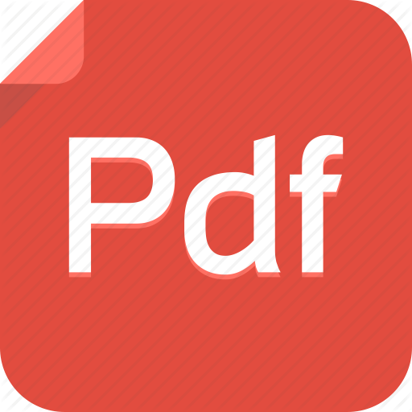

---
html:
  embed_local_images: true
  embed_svg: true
puppeteer: 
  printBackground: true
export_on_save:
    html: true
    puppeteer: true
id: "roteiro"
---
@import "../../estilo/piStyle.less"

# :ledger: Roteiro de Estudo

<b> PROGRAMAÇÃO IMPERATIVA

COMP0334 - T17 </b>
  
Prof. Kalil Araujo Bispo

## Semana 01 - (25/11/2024 a 30/11/2024)

 <b>Videoaulas</b></img>

<!--
* [Metodologia](https://youtu.be/mGCPgINEztI) (5 min)
* [Recursos Didáticos e AVA's](https://youtu.be/n_ci-HV-N0U) (12 min)
* [Controle de Frequência](https://youtu.be/OKco5TJCLbo) (7 min)
* [Sobre as Turmas de Programação Imperativa de 2019.2](https://youtu.be/sqLH1XFVY2Y) (2 min)
* [Conteúdo Programático](https://youtu.be/sk3RNxf0VUg) (2 min)
* [Forma de Avaliação](https://youtu.be/5SPUmtGWyPM) (2 min)
* [Calendário de Provas](https://youtu.be/0pNTEZQPKDE) (2 min)
* [Como serão as Provas](https://youtu.be/L9kWztEjXq0) (2 min)
* [Bibliografia](https://youtu.be/MzYPfijY5uo) (2 min)
-->
* [Sobre a Disciplina Programação Imperativa](https://youtu.be/qkML5DSMxI4) (6 min) [<i> Slides</i></img>](../../slides/01-SobrePI.pdf)

* [O que é Programar](https://youtu.be/ngL_U_slWI8) (10 min) [ <i> Slides</i></img>](../../slides/02-O_que_e_Programar.pdf)

* [Motivação para Programar](https://youtu.be/nHCG4Zib-Tg) (11 min) [ <i> Slides</i></img>](../../slides/03-Motivacao_Programar.pdf)

* [Arquitetura de Hardware](https://youtu.be/Eku8qyVp0_A) (17 min) [ <i> Slides</i></img>](../../slides/04-Hardware.pdf)

* [Visão Geral da Linguagem Python](https://youtu.be/QIBVGzePI4k) (24 min) [ <i> Slides</i></img>](../../slides/05-Visao_Geral_Python.pdf)

:computer: **Atividades**

* Hora do código (Angry Birds, Plants x Zombies e A era do Gelo) - [http://studio.code.org/hoc/1](http://studio.code.org/hoc/1) (desafios de 1 a 20)
  * Esta atividade é bem divertida e permite que vocês entendam que o computador executa as ordens na sequência que vocês determinam (dando o resultado certo ou errado).
  * Aprenderá conceitos como:
    * Comandos Sequenciais
    * Comandos de Repetição com total de iterações definidas
    * Comandos de Repetição até atingir condição
    * Comandos Condicionais Se, Se-Senão

 <b>Leitura recomendada</b></img>

 * Capítulo 1 do livro [Python for Everybody](../../livros/python_for_everybody.pdf) ou [Python para Informática](../../livros/python_para_informatica.pdf) (Tradução)

 <b>Netflix (opcional)</b></img>

  * [Explicando - Temporada 2 - Episódio: Código de Programação](https://www.netflix.com/br/title/80216752) (24 min)

 ---

**_Ambiente de Desenvolvimento/Programação_**

 <b>Videoaulas</b></img>

* [Explorando o Repl.it](https://youtu.be/uuEzyAfvb_U) (12 min)

 <b>Videoaulas (opcional)</b></img>

 * [Preparação do Ambiente de Desenvolvimento](https://youtu.be/_Bc5ziyF1I4)   (23 min)
  
 * [Explorando o Ambiente Integrado de Desenvolvimento IDLE](https://youtu.be/kKUJ0GGhsKI) (6 min)

## Semana 02

 <b>Videoaulas</b></img>

  * [Constantes e variáveis](https://youtu.be/uiGeQD_z2vs) (15 min) [<i> Slides</i></img>](../../slides/06-Constantes_e_Variaveis.pdf)

  * [Comando de atribuição](https://youtu.be/oudSxfCBeuw) (11 min) [<i> Slides</i></img>](../../slides/07-Comando_de_Atribuicao.pdf)

  * [Atribuição múltipla](https://youtu.be/MDx0_xB2NXQ) (6 min) [<i> Slides</i></img>](../../slides/08-Atribuicao_Multipla.pdf)

  * [Comandos de entrada e saída](https://www.youtube.com/watch?v=dwKYRoUTLXY) (25 min) [<i> Slides</i></img>](../../slides/09-Comandos_de_Entrada_e_Saida.pdf)

  * [Comentários](https://www.youtube.com/watch?v=w1_UKQV4w_A) (9 min) [<i> Slides</i></img>](../../slides/10-Comentarios.pdf)

  * [Tipos de dados, conversão de tipos](https://www.youtube.com/watch?v=dREZCTH-VGA) (17 min) [<i> Slides</i></img>](../../slides/11-Tipos_de_Dados.pdf)

  * [Expressões Numéricas](https://youtu.be/-8wUrt50CtU) (9 min) [<i> Slides</i></img>](../../slides/12-Expressoes_Numericas.pdf)

  * [Ordem de Avaliação e Precedência de Operadores](https://youtu.be/lED0b3oWo9E) (7 min)  [<i> Slides</i></img>](../../slides/14-Ordem_de_Avaliacao.pdf)

 <b>Leitura recomendada</b></img>

  * Seções 2.1 a 2.12 e e Seção 6.11 do livro [Python for Everybody](../../livros/python_for_everybody.pdf) ou [Python para Informática](../../livros/python_para_informatica.pdf) (Tradução)
  * Capítulo 2 do livro [Como pensar como um Cientista da Computação](../../livros/como_pensar_como_um_cc_usando_python.pdf))

 <b>Videoaulas (The Huxley)</b></img>

  * [Motivos para usar o The Huxley](https://youtu.be/JIh9T9XgPlQ) (18 min)
  
  * [Tour no The Huxley](https://youtu.be/pu5KgL89XVU) (9 min)
  
  * [Primeira submissão ao The Huxley](https://youtu.be/VWZjD_OekzE) (19 min)
  
  * [Dicas de uso do The Huxley](https://youtu.be/vHVngNKTR80) (10 min)
  
  * [Saída Amigável no The Huxley](https://youtu.be/gBi7jrYwn9M) (8 min)
  
  * [Problema Resolvido: Tabuada](https://youtu.be/B7wECEu6Nuc) (9 min)
  
  * [Problema Resolvido: Volume da Esfera](https://youtu.be/m53IuRan06E) (8 min)

  * [Problema Resolvido: Vacinação Infantil](https://youtu.be/76tStyfGnsY) (5 min)

  * [Problema Resolvido: Converter segundos em horas, min e segundos](https://youtu.be/3DAVPyIauvA) (10 min)

 <b>Atividades de Programação (The Huxley)</b></img>

  * [Guia de Cadastramento no The Huxley](/thehuxley/GuiaCadastramentoTheHuxley.pdf)
    
  * Cadastrar-se no The Huxley ([http://thehuxley.com](http://thehuxley.com))
    
  * [Questionário 01 (The Huxley)](http://thehuxley.com)
    
  * [Questionário 02](http://thehuxley.com)

:iphone: **Instalar e testar o aplicativo [The Huxley Mobile](https://play.google.com/store/apps/details?id=br.ufs.dcomp.thehuxleymobile) (Android)**

:iphone: **Instalar e testar o aplicativo [Moodley](https://play.google.com/store/apps/details?id=br.ufs.avamovel.moodley) (Android)**

## Semana 03
  

 <b>Videoaulas</b></img>

  * [Expressões Relacionais e Booleanas](https://youtu.be/qVMP9SkeFmE) (14 min)  [<i> Slides</i></img>](../../slides/13-Expressoes_Relacionais_Booleanas.pdf)

  * [Comandos Condicionais simples](https://www.youtube.com/watch?v=nNRVOAcPAoM) (10 min) [<i> Slides</i></img>](../../slides/15-Comando_Condicional.pdf)
    
  * [Blocos de código (indentação)](https://www.youtube.com/watch?v=a91qZE3XZmA) (13 min)  [<i> Slides</i></img>](../../slides/16-Blocos_de_Codigo.pdf)
  
  *  [Comandos Condicionais Aninhados e Múltiplos](https://www.youtube.com/watch?v=MO1Nf86LKBs) (18 min) [<i> Slides</i></img>](../../slides/17-Comando_Condicional_Aninhado_Multiplo.pdf)
  
  

 <b>Videoaulas (The Huxley)</b></img>

  * [Problema Resolvido: Análise de Crédito](https://youtu.be/lwQKmD7aIJg) (10 min)
  * [Problema Resolvido: Aluguel de Imóvel](https://youtu.be/nm6l3exbB9o) (11 min)
  * [Problema Resolvido: Chance de Aprovação](https://youtu.be/1qGzT6zgXDc) (18 min)
  * [Problema Resolvido: Decrescente 3](http://youtu.be/mlHj_T7D5xc) (12 min)

 <b>Leitura recomendada</b></img>

 * Seções 3.1 a 3.6 do livro [Python for Everybody](../../livros/python_for_everybody.pdf) ou [Python para Informática](../../livros/python_para_informatica.pdf) (Tradução)
 * Capítulos 2 e 4 do livro [Como pensar como um Cientista da Computação](../../livros/como_pensar_como_um_cc_usando_python.pdf)

 <b>Atividades de Programação (The Huxley)</b></img>

  * [Questionário 03](http://thehuxley.com)
  * [Questionário 04](http://thehuxley.com)

## Semana 04

 <b>Videoaulas</b></img>

  
* [Funções predefinidas e Bibliotecas](https://youtu.be/sK-ootef7rI) (12 min) [<i> Slides</i></img>](../../slides/19-Funcoes_Predefinidas_Bibliotecas.pdf)

* [Definição de Funções](https://youtu.be/ogltKzMfleU) (23 min) [<i> Slides</i></img>](../../slides/20-Definicao_Funcoes.pdf)

* Programação com Abordagem Top-Down [<i> Slides</i></img>](../../slides/21-Projeto_Programas.pdf)

  - [Solução de Problemas usando Pensamento Computacional](https://drive.google.com/file/d/1qqAsAb7rLcBRefNyHSQtFio6B4R3q8l9/view?usp=sharing) (18 min)
  - [Projetando Soluções: Entendendo o Problema](https://drive.google.com/file/d/19NMhTVEOI5gKbvKRQelkN24jYPauZwkV/view?usp=sharing) (11 min)
  - [Projetando com Exemplos](https://drive.google.com/file/d/1RU6FD0TnJXN8kjYeDjBSipGI6ZG6vY_j/view?usp=sharing) (8 min)
  - [Composição](https://drive.google.com/file/d/15yOztDVzoMRH9T6xY92kyvEq2C0b0Mk4/view?usp=sharing) (8 min)
  - [Decomposição](https://drive.google.com/file/d/1aUofFbSfZhv5joVwpFCA_GaNA_abmHxE/view?usp=sharing) (8 min)
  - [Verificar Solução](https://drive.google.com/file/d/16mTtPkG27o8nbmnu4C8jtlpMDeUXQQ6J/view?usp=sharing) (9 min)
  - [Analisar a Solução](https://drive.google.com/file/d/1nnPgaLSimzvhspGZur-IAWiJZugffjTf/view?usp=sharing) (10 min)

 <b>Videoaulas (The Huxley)</b></img>

* [Problema Resolvido: Acima da Média](https://drive.google.com/file/d/1FZSBq6vm8IGP3mSnrjKeQoa6CPgWwC7p/view?usp=sharing) (20 min)
* [Problema Resolvido: Dias entre Datas](https://drive.google.com/file/d/1QMx5aP2t8l0CjW8OnZx5Z0imhUq1xEgD/view?usp=sharing) (36 min)

 <b>Leitura recomendada</b></img>

* Seções 4.1 a 4.11 do livro [Python for Everybody](../../livros/python_for_everybody.pdf) ou [Python para Informática](../../livros/python_para_informatica.pdf) (Tradução)
* Capítulos 3 e 5 do livro [Como pensar como um Cientista da Computação](../../livros/como_pensar_como_um_cc_usando_python.pdf)

 <b>Atividades de Programação (The Huxley)</b></img>

* [Questionário 05](http://thehuxley.com) 

## Semana 05

 <b>Videoaulas</b></img>

 * [Laço While](https://youtu.be/QfW6Ukv-A9I) (16 min) [<i> Slides</i></img>](../../slides/22-Laco_While.pdf)

 * [Comandos Break e Continue](https://youtu.be/uCmAsGVsYdo) (9 min) [<i> Slides</i></img>](../../slides/23-Comandos_Break_Continue.pdf)

 * [Usos do laço While](https://youtu.be/BrlITSnT_uI) (17 min) [<i> Slides</i></img>](../../slides/24-Usos_Laco_While.pdf)
  
 * Resolvendo Problemas com Invariantes [<i> Slides</i></img>](../../slides/24.1-ResolvendoProblemasComInvariantes.pdf)

   - [Invariantes](https://drive.google.com/file/d/1VWpA0yG8j-T6kibFom4zLTpic8yGnhpv/view?usp=sharing) (18 min)
   - [Laços como aproximações à solução: Fatorial](https://drive.google.com/file/d/1pGVX4XNNXchRgSnbkvgs22rGzFnFH7pC/view?usp=sharing) (15 min)
   - [Laços como aproximações à solução: Número de Euler](https://drive.google.com/file/d/1aniAqiRtzy071idcxZAiXP1Yz-brV_hM/view?usp=sharing) (17 min)
   - [Laços como aproximações à solução: Busca Sequencial](https://drive.google.com/file/d/1go9Nt2G5QE0bU6XaWNs4ERHJJXk4GANx/view?usp=sharing) (22 min)
   - [Sequenciais de valores terminados por uma Marca](https://drive.google.com/file/d/1A6xgFUzBfHgXGWA3G4-JCeZWNBDYKchU/view?usp=sharing) (11 min)

 <b>Videoaulas (The Huxley)</b></img>

  * [Problema Resolvido: Vestibular](https://youtu.be/T6t-YMWxJw8) (9 min)
  * [Problema Resolvido: Livros na Mochila](https://youtu.be/fx2mFSW0tHo) (9 min)
  * [Problema Resolvido: Dieta da Farofa](https://youtu.be/2dWCkNShaEQ) (7 min)

 <b>Leitura recomendada</b></img>

  * Seções 5.1 a 5.5 do livro [Python for Everybody](../../livros/python_for_everybody.pdf) ou [Python para Informática](../../livros/python_para_informatica.pdf) (Tradução)
  * Capítulos 3 e 6 do livro [Como pensar como um Cientista da Computação](../../livros/como_pensar_como_um_cc_usando_python.pdf)

 <b>Atividades de Programação (The Huxley)</b></img>

  * [Questionário 06](http://thehuxley.com)
  * [Questionário 07](http://thehuxley.com)

## Semana 06

 <b>Videoaulas</b></img>

  * [Strings](https://youtu.be/Ppq8Hxrjo7c) (23 min) [<i> Slides</i></img>](../../slides/25-Strings.pdf)

  * [Laço For](https://youtu.be/CfJwraopSpk) (13 min) [<i> Slides</i></img>](../../slides/26-Laco_For.pdf)

  * [Usos do Laço For](https://youtu.be/Y1LPAgY7_yw) (19 min) [<i> Slides</i></img>](../../slides/27-Usos_Laco_For.pdf)

  * [Operadores e Funções para Strings](https://youtu.be/TVlKiewwKLA) (19 min) [<i> Slides</i></img>](../../slides/28-Operadores_Funcoes_Strings.pdf)

  * [Função Range](https://youtu.be/Nq5o586VM_w) (11 min) [<i> Slides</i></img>](../../slides/29-Funcao_range.pdf)

 <b>Videoaulas (The Huxley)</b></img>

  * [Problema Resolvido: Vestibular - com laço For](https://youtu.be/rofzRrqyi0I) (9 min)
  * [Problema Resolvido: Triângulo com uma String](https://youtu.be/m8Baev_jK1I) (10 min)
  * [Problema Resolvido: Digitação Amigável de Inteiros](https://youtu.be/qbRWKLHw1I0) (14 min)
  * [Problema Resolvido: Menor Velocidade Final de 3 Carros](https://youtu.be/j2N3hcdz_cc) (12 min)
  * [Problema Resolvido: Correção de Provas Objetivas](https://youtu.be/HrrRDnJpdKU) (10 min)

 <b>Leitura recomendada</b></img>

  * Seções 5.6 a 5.7 e 6.1 a 6.11 do livro [Python for Everybody](../../livros/python_for_everybody.pdf) ou [Python para Informática](../../livros/python_para_informatica.pdf) (Tradução)
  * Capítulo 7 do livro [Como pensar como um Cientista da Computação](../../livros/como_pensar_como_um_cc_usando_python.pdf)

 <b>Atividades de Programação (The Huxley)</b></img>

  * [Questionário 08](http://thehuxley.com)
  * [Questionário 09](http://thehuxley.com)

## Semana 7

  * <b>1a Prova</b> :writing_hand: 

## Semana 08

 <b>Videoaulas</b></img>

* [Listas](https://youtu.be/X_Rrrs3BOeE) (24 min) [<i> Slides</i></img>](../../slides/31-Listas.pdf)

* [Funções/Métodos de Listas](https://youtu.be/hmy1_0FvDo0) (17 min) [<i> Slides</i></img>](../../slides/32-Funcoes_Listas.pdf)

* [Aplicações de Listas](https://youtu.be/tuHhbX2rIlM) (12 min) [<i> Slides</i></img>](../../slides/33-Aplicacoes_Listas.pdf)

* [Compreensão de Listas](https://youtu.be/UzEPE6I4cD4) (20 min) [<i> Slides</i></img>](../../slides/34-Compreensao_de_Listas.pdf)

* [Referências e Aliasing](https://drive.google.com/file/d/1TyLJF6KWnWcaBHg2ZhfubCVT-bcCv08_/view?usp=sharing) (24 min) [<i> Slides</i></img>](../../slides/35-Referencias.pdf)

* [Estratégias de invariantes para Listas](https://drive.google.com/file/d/1IJ1BY5JDOMtXSejR0hgqRoXGt-ecLgG1/view?usp=sharing) (12 min) [<i> Slides</i></img>](../../slides/35-a-InvariantesListas.pdf)

 <b>Videoaulas (The Huxley)</b></img>

* [Problema Resolvido: Desafio do Menor e Maior Número](https://youtu.be/GSBxSLhrbg8) (11 min)
* [Problema Resolvido: Lista de Chamada](https://youtu.be/Z3Mm3l1L_tM) (14 min)
* [Problema Resolvido: Média de um Conjunto de Inteiros](https://youtu.be/MXQj-EbAK-Q) (9 min)
* [Problema Resolvido: Maior, Menor e Média](https://youtu.be/Kk6j4lBB6Zk) (11 min)
* [Problema Resolvido: Contar letras em um texto](https://youtu.be/XYlwnuBAeik) (12 min)

 <b>Leitura recomendada</b></img>

* Capítulo 8 do livro [Python for Everybody](../../livros/python_for_everybody.pdf) ou [Python para Informática](../../livros/python_para_informatica.pdf) (Tradução)
* Capítulo 8 do livro [Como pensar como um Cientista da Computação](../../livros/como_pensar_como_um_cc_usando_python.pdf)

 <b>Atividades de Programação (The Huxley)</b></img>

  * [Questionário 10](http://thehuxley.com)
  

## Semanas 09

 <b>Videoaulas</b></img>

* [Algoritmos de ordenação: Seleção e Inserção](https://drive.google.com/file/d/1ZbOsX_k59nUMdEuR9XjtS4uzTHlXaqK-/view?usp=sharing) (18 min) [<i> Slides</i></img>](../../slides/35-b-OrdenacaoSelecaoInsercao.pdf)

* [Ordenação pelo método da bolha](https://drive.google.com/file/d/1vKmHMzMqxrqMaMxQ7vlq3DFzJwSKQZjr/view?usp=sharing) (23 min) [<i> Slides</i></img>](../../slides/35-c-OrdenacaoBolha.pdf)

* [Busca binária](https://drive.google.com/file/d/16ioBivbs-8p8l_1S1zeShGY7lwktpdQv/view?usp=sharing) (12 min) [<i> Slides</i></img>](../../slides/35-d-BuscaBinaria.pdf)

* Matrizes usando listas bidimensionais [<i> Slides</i></img>](../../slides/35-e-Matrizes.pdf)

    - [Representação de matrizes](https://drive.google.com/file/d/1GpVd-D6YDOqmh-erm_IuVvLw38cy0EfH/view?usp=sharing) (19 min) 

    - [Criação de matrizes](https://drive.google.com/file/d/1GcUS4DuGaRqdUVtSgxMNgOvk2VtDGUML/view?usp=sharing) (16 min)

    - [Navegação em partes da matriz](https://drive.google.com/file/d/1usKKqM-tXn7pAN_ePxVv5wtKF7RYjpmP/view?usp=sharing) (10 min)

 <b>Videoaulas (The Huxley)</b></img>

* [Problema Resolvido: Matriz Transposta](https://drive.google.com/file/d/1PaLWCSiCL07ZQNFQNI57f8ChIv4a9rk2/view?usp=sharing) (20 min)
* [Problema Resolvido: Quadrado Mágico](https://drive.google.com/file/d/1oq_KV1uOsby0EKa2BcWZVRWmBAniolBs/view?usp=sharing) (22 min)

 <b>Leitura recomendada</b></img>

* Seção 5.3.21 8 do livro [Como pensar como um Cientista da Computação](http://albertocn.sytes.net/2020-2/pi/../../livros/como_pensar_como_um_cc_usando_python.pdf)
* Lição 9 do livro online [Teach Python 3 and web design with 200+ exercises](https://snakify.org/en/lessons/two_dimensional_lists_arrays/)

 <b>Atividades de Programação (The Huxley)</b></img>

  * [Questionário 11](http://thehuxley.com)

 

## Semana 10

 <b>Videoaulas</b></img>

* [Funções Recursivas](https://youtu.be/7MNLhjd9N9I) (24 min) [<i> Slides</i></img>](../../slides/30-Funcoes_Recursivas.pdf)

* Recursão Primitiva [<i> Slides</i></img>](../../slides/30.1-recursaoPrimitiva.pdf)

    - [Recursão Primitiva nos naturais](https://drive.google.com/file/d/19o925YYpWQGm88q0H8shMvcTf-4oOI-S/view?usp=sharing) (23 min)

    - [Recursão Primitiva em listas](https://drive.google.com/file/d/1MIYwueZVArfzwgYjPuFF_d4W4xsj2Ekr/view?usp=sharing) (14 min)

* Recursão Geral [<i> Slides</i></img>](../../slides/30.2-recursaoGeral.pdf)

    - [Recursão geral](https://drive.google.com/file/d/1ClSPeJIBwvM4W7qst9exN_hpYSUF6Kab/view?usp=sharing) (23 min)

    - [Exemplos](https://drive.google.com/file/d/1dyK-Lmo6AxkdDXAny3Hr4fyiZ-NZLqGF/view?usp=sharing) (15 min)

* [Recursão com comandos](https://drive.google.com/file/d/1fXOI6Q7_IvZ3I1hA_HHlgmNZ1gbeflL_/view?usp=sharing) (25 min) [<i> Slides</i></img>](../../slides/30.3-recursaoComComandos.pdf)

* [Chamadas de funções: pilha de *frames*](https://drive.google.com/file/d/1qpUOiult-fim82NMQRSMTS45AUsSHkNW/view?usp=sharing) (30 min)
    - [Site - endereços de retorno](https://sites.cs.ucsb.edu/~pconrad/cs8/topics.beta/theStack/02/)
    - [Site - variáveis e argumentos](https://sites.cs.ucsb.edu/~pconrad/cs8/topics.beta/theStack/04/)
    - [Site - chamadas recursivas](https://sites.cs.ucsb.edu/~pconrad/cs8/topics.beta/theStack/06/)
    
  
 <b>Videoaulas (The Huxley)</b></img>

* [Problema Resolvido: Inversão de Strings](https://youtu.be/W3yZhtOReoA) (11 min)
* [Problema Resolvido: Somas Sucessivas como Multiplicação](http://youtu.be/ZD_7w53S0Eo) (11 min)

 <b>Leitura recomendada</b></img>

* Capítulo 5 do livro [Como pensar como um Cientista da Computação](../../livros/como_pensar_como_um_cc_usando_python.pdf)

 <b>Atividades de Programação (The Huxley)</b></img>
  
  * [Questionário 12](http://thehuxley.com)

## Semana 11

 <b>Videoaulas</b></img>

* [Dicionários](https://youtu.be/i35apmGUDn8) (20 min) [<i> Slides</i></img>](../../slides/36-Dicionarios.pdf)

* [Aplicações de Dicionários](https://youtu.be/vPje_6MH-Pc) (21 min) [<i> Slides</i></img>](../../slides/37-Aplicacoes_Dicionarios.pdf)

 <b>Videoaulas (The Huxley)</b></img>

* [Problema Resolvido: Tradução de texto](https://youtu.be/PL60VCPSRUM) (14 min)
* [Problema Resolvido: Avaliação das notas de uma turma](https://youtu.be/gcYBtqbwtVQ) (12 min)

 <b>Leitura recomendada</b></img>

* Capítulo 9 do livro [Python for Everybody](../../livros/python_for_everybody.pdf) ou [Python para Informática](../../livros/python_para_informatica.pdf) (Tradução)
* Capítulo 10 do livro [Como pensar como um Cientista da Computação](../../livros/como_pensar_como_um_cc_usando_python.pdf)

 <b>Atividades de Programação (The Huxley)</b></img>

  * [Questionário 13](http://thehuxley.com)

## Semana 12

 <b>Videoaulas</b></img>

* [Tuplas](https://youtu.be/lWQocU1BkYo) (13 min) [<i> Slides</i></img>](../../slides/38-Tuplas.pdf)

* [Aplicações de Tuplas](https://youtu.be/xmJsnlI4KtQ) (13 min) [<i> Slides</i></img>](../../slides/39-Aplicacoes_Tuplas.pdf)

* Conjuntos

* Aplicações de Conjuntos

 <b>Videoaulas (The Huxley)</b></img>

* [Problema Resolvido: Moda de conjunto de inteiros](https://youtu.be/VAd9ly2CDb0) (13 min)

 <b>Leitura recomendada</b></img>

* Capítulo 10 do livro [Python for Everybody](../../livros/python_for_everybody.pdf) ou [Python para Informática](../../livros/python_para_informatica.pdf) (Tradução)
* Capítulo 9 do livro [Como pensar como um Cientista da Computação](../../livros/como_pensar_como_um_cc_usando_python.pdf)

 <b>Atividades de Programação (The Huxley)</b></img>

  * [Questionário 14](http://thehuxley.com)
  * [Questionário 15](http://thehuxley.com)

## Semana 13

 <b>Videoaulas</b></img>

*   [Arquivos](https://youtu.be/OMteKPI4nbo) (20 min) [<i> Slides</i></img>](../../slides/40-Arquivos.pdf)

*   [Aplicações de Arquivos](https://youtu.be/CpD-GCe2p9Q) (19 min) [<i> Slides</i></img>](../../slides/41-Aplicacoes_Arquivos.pdf)

 <b>Leitura recomendada</b></img>

* Capítulo 7 do livro [Python for Everybody](../../livros/python_for_everybody.pdf) ou [Python para Informática](../../livros/python_para_informatica.pdf) (Tradução)
* Capítulo 11 do livro [Como pensar como um Cientista da Computação](../../livros/como_pensar_como_um_cc_usando_python.pdf)

## Semana 14

* <b>2a Prova</b> :writing_hand: 

## Semana 15

* **Entrega de notas da 2a Prova**
* **Resolução da 2a prova**
* **Prova de Reposição**
* **Resolução da prova de reposição**
* **Entrega das notas finais**
* **Encerramento** :smiley:

